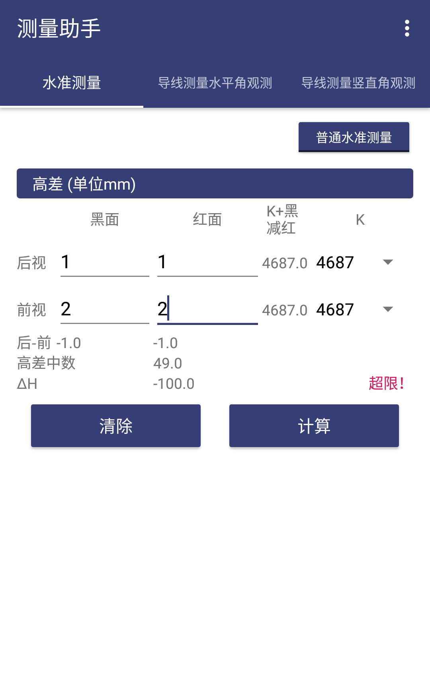

# SurveyHelper

测量实习中计算验证测量结果，包括水准测量、导线测量（水平角、竖直角观测）的数据计算与验证。

适用于地信、测绘等专业测量实习。

## 功能

* 水准测量：前后距，视距差（四等水准测量）；高差中数、ΔH等（普通水准测量）

* 导线测量：上、下半测回角值，半测回差，一测回平均角值（水平角观测）；竖盘左右半测回角值，竖盘指标差，一测平均角值（竖直角观测）

## License

[GPL 2.0](http://opensource.org/licenses/GPL-2.0)
